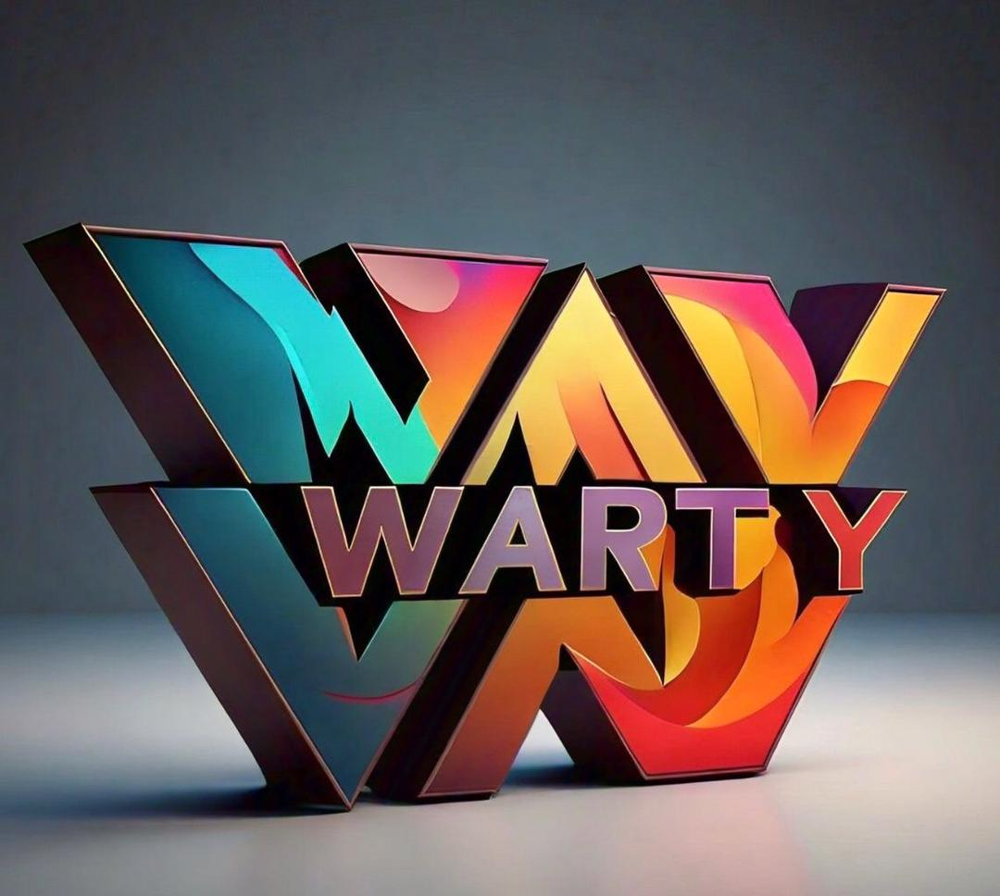

# WARTY 🐗 - Warthog Coin Ecosystem

 <!-- Logo path -->

## Table of Contents
- [WARTY 🐗 - Warthog Coin Ecosystem](#warty----warthog-coin-ecosystem)
  - [Table of Contents](#table-of-contents)
  - [Overview](#overview)
  - [WARTY Coin Launch](#warty-coin-launch)
  - [NFT Creation and Presale](#nft-creation-and-presale)
  - [Website Development](#website-development)
    - [Technology Stack](#technology-stack)
    - [Pages and Features](#pages-and-features)
  - [Smart Contracts and Blockchain Integration](#smart-contracts-and-blockchain-integration)
  - [Community Engagement and Marketing](#community-engagement-and-marketing)
  - [Next Steps](#next-steps)
  - [Technologies Used](#technologies-used)
  - [Contributing](#contributing)
  - [License](#license)
  - [Contact](#contact)

## Overview
WARTY is a comprehensive ecosystem for the Warthog coin, designed to facilitate a vibrant community around cryptocurrency and NFTs. With a focus on user engagement and transparency, WARTY aims to create a dynamic platform for launching and managing WARTY coins and NFTs.


## WARTY Coin Launch
- **Platform:** Utilize [Pump.fun](https://pump.fun) for creating and launching your WARTY coin.
- **Initial Distribution:** Strategize the initial distribution of WARTY coins, including allocations for the team, marketing efforts, and community incentives.

## NFT Creation and Presale
- **Metadata and Storage:** Use [Arweave](https://arweave.net) for storing NFT metadata and images.
- **Minting NFTs:** Utilize the Solana Python SDK or JavaScript (Next.js and TypeScript) for creating and minting NFTs.
- **Presale Mechanism:** Develop a smart contract to manage the presale process, enabling users to purchase NFTs with WARTY tokens.

## Website Development

### Technology Stack
- **Frontend:** [Next.js](https://nextjs.org) and [TypeScript](https://www.typescriptlang.org) for a responsive and dynamic user interface.
- **Backend:** [Node.js](https://nodejs.org) with [Express](https://expressjs.com) or a serverless architecture using AWS Lambda or Vercel.
- **Database:** [MongoDB](https://www.mongodb.com) or [Firebase](https://firebase.google.com) for storing user data, comments, and NFT metadata.
- **Blockchain Interaction:** Use [web3.js](https://github.com/web3/web3.js) or [solana-web3.js](https://github.com/solana-labs/solana-web3.js) to interact with the Solana blockchain.

### Pages and Features

1. **Home Page:**
   - Overview of the Warthog project.
   - Links to other sections of the site.
   - Latest news and updates.

2. **Shorts:**
   - Blog-style posts featuring short, engaging content.
   - Support for uploading multiple shorts with descriptions, comments, reactions, and favorites.
   - Example: Users can post short updates, memes, or announcements.

3. **Events:**
   - A list of ongoing and upcoming competitions.
   - Detailed descriptions of each competition, including rules, prizes, and participation guidelines.
   - Voting system for users to vote on their favorite entries.
   - Example: Meme competitions where users create and submit memes about Warthog.

4. **News:**
   - Updates and notifications regarding the Warthog project.
   - Announcements about new features, partnerships, and community events.

5. **NFTs:**
   - Information about the NFT presale and eligibility criteria.
   - A list of NFTs showcasing details about holders and transaction history.
   - Example: Display current owners, previous owners, and transaction history for each NFT.

## Smart Contracts and Blockchain Integration
- **Presale Smart Contract:**
  - Manage NFT purchases using WARTY tokens.
  - Record the amount of WARTY tokens spent by each user.

- **Value Addition Smart Contract:**
  - Update NFT metadata and value based on WARTY tokens spent.
  - Implement a mechanism for users to sell their NFTs.

- **Marketplace Integration:**
  - Integrate with an existing NFT marketplace on Solana or build a custom solution.
  - Implement transaction fees to generate revenue for the development team.

## Community Engagement and Marketing
- **Social Media:** Utilize platforms like Twitter, Discord, and Telegram to connect with your community.
- **Competitions and Events:** Regularly host events to maintain community engagement.
- **Transparency:** Keep the community updated on project developments and milestones.

## Next Steps
1. **Start Your Solana Development Course:**
   - Build a solid foundation in Solana development, focusing on JavaScript and TypeScript.

2. **Plan Your Website Structure:**
   - Design the layout and features of each page.
   - Choose the technology stack and tools for implementation.

3. **Develop and Test Smart Contracts:**
   - Write and rigorously test smart contracts for presale, value addition, and marketplace transactions.

4. **Launch WARTY Coin:**
   - Use Pump.fun to initiate the launch of your WARTY coin and manage the initial distribution.

5. **Create and Mint NFTs:**
   - Leverage the Solana SDK to mint your NFTs with hidden metadata.

6. **Build and Launch the Website:**
   - Develop the website using Next.js and TypeScript.
   - Integrate smart contracts and blockchain functionalities.

7. **Engage Your Community:**
   - Keep your community informed and engaged through regular updates and social media interactions.

## Technologies Used
- **React**: For building the user interface.
- **Next.js**: For server-side rendering and building a fast web application.
- **TypeScript**: For type safety and better development experience.
- **Node.js**: For backend development.
- **MongoDB/Firebase**: For data storage solutions.
- **Solana SDK**: For blockchain interactions.
- **Tailwind CSS**: For styling the application.

## Contributing
We welcome contributions to enhance the WARTY ecosystem! To contribute:
1. **Fork the Repository**.
2. **Create a New Branch**:
   ```bash
   git checkout -b feature/YourFeature
   ```
3. **Make Your Changes** and commit them:
   ```bash
   git commit -m "Add your message here"
   ```
4. **Push to the Branch**:
   ```bash
   git push origin feature/YourFeature
   ```
5. **Open a Pull Request**.

## License
This project is licensed under the MIT License - see the [LICENSE](LICENSE) file for details.

## Contact
For any inquiries or feedback, feel free to reach out:

- **Your Name** - [Mail](mailto:lchinecherem2018@gmail.com)
- **GitHub**: [Levi Chinecherem C.](https://github.com/Levi-Chinecherem)

---
Thank you for checking out WARTY! We hope you enjoy using it as much as we enjoyed building it.